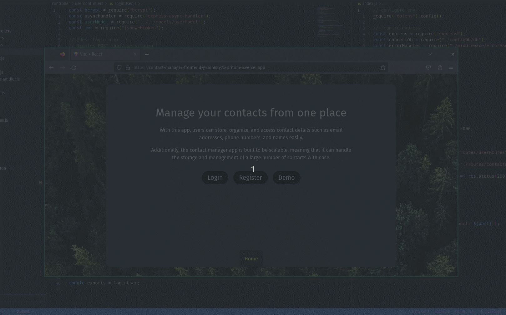

# Contacts Manager App (Frontend)

This is a fullstack application to track your contacts

 

---

## Live Demo:

| Desc                    | LINK                                                                                                       |
| ----------------------- | ---------------------------------------------------------------------------------------------------------- |
| Backend API Live link   | [contacts-manager-api](https://contact-manager-fullstack.onrender.com/api/hello)                                     |
| Full stack website demo | [contacts-manager-full-stack-app](https://contact-manager-frontend-g6mn68y2x-pritom-5.vercel.app) |

 

---

## APP Demo:

 

---

## Backend repo:

[Backend-link-github](https://github.com/pritom-5/Contact-Manager-Backend)

 

---

## Techstack used:

- React
- CSS
- HTML
- Express
- Node js
- Mongodb
- Mongoose
- Atlas
- JWT
- Bcrypt

---

## Run this repo in local repo.

- In the constants file update `DOMAIN`
- Run `npm install` to install all the depencencies
- Run `npm run dev` to spin localhost.
